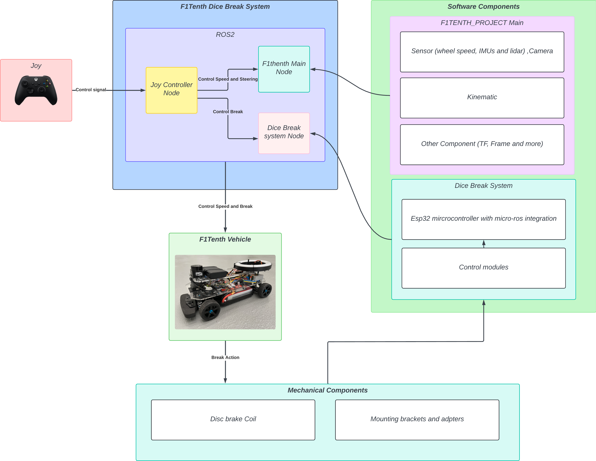
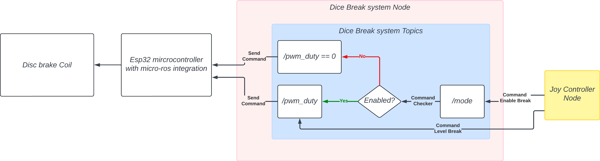
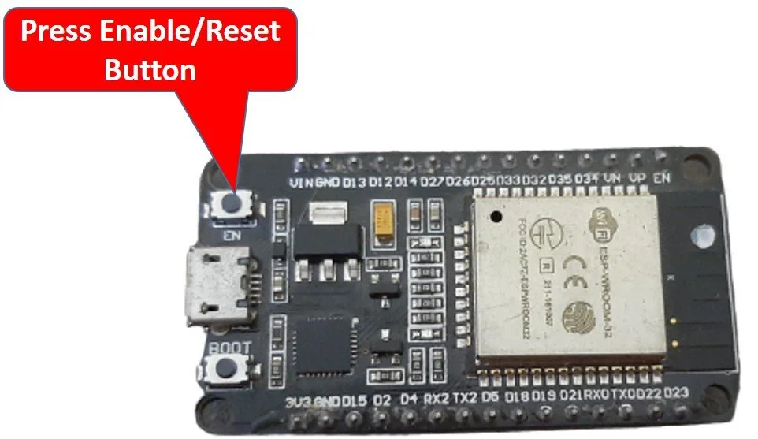
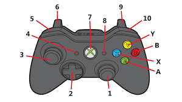

# F1TENTH Braking System

**Disc Brake System for Controlled Drifting in F1TENTH**

This package is part of the broader [F1TENTH Project](https://github.com/kkwxnn/F1TENTH_PROJECT) and provides a disc brake control system to enable precise braking and controlled drifting in F1TENTH vehicles.

---

## Table of Contents

* [System Overview](#system-overview)
* [Break Node System Overview](#break-node-system-overview)
* [Overview](#overview)
* [Installation](#installation)
* [Usage](#usage)
* [Hardware](#hardware)
* [Our Team](#our-team)

---

## System Overview

<p align="center">
  
</p>

The F1TENTH Braking System integrates both software and hardware components to enable disc brake actuation and controlled drifting on your F1TENTH vehicle. The system uses ROS2 for modular communication between nodes, an ESP32 microcontroller for real-time brake control, and a dedicated coil-based disc brake mechanism for reliable stopping power.

**Key features include:**

* **Joystick-based control** for speed, steering, and braking.
* **ROS2 nodes** handling command processing, including speed and brake logic.
* **ESP32 microcontroller** with micro-ROS for low-latency actuation.
* **Custom mechanical assemblies** for mounting and actuation.

This architecture ensures the braking system is robust, easy to integrate, and well-suited for advanced driving maneuvers like drifting and emergency stops.

---

## Break Node System Overview

<p align="center">
  
</p>

The **Break Node System** manages the actuation logic for the disc brake using ROS 2 topics and the ESP32 microcontroller. Its operation involves several key elements:

* The **Joy Controller Node** receives joystick input and publishes two main commands:

  * **Enable Break** (on `/mode` topic)
  * **Break Level** (on `/pwm_duty` topic)
* The **Dice Break System Node** acts as a command checker, ensuring the brake is only engaged if enabled. If the brake is not enabled, the system sends a duty of zero.
* When enabled, the system passes the requested duty cycle to the ESP32 microcontroller, which then actuates the disc brake coil.
* The ESP32, using micro-ROS, directly controls the disc brake coil based on incoming commands.

This structure provides **safety** (the brake can only be actuated when enabled), **flexibility** (level-based braking), and real-time control suitable for F1TENTH autonomous driving.


---

## Installation

> [!NOTE]  
> This package depends on the main [F1TENTH Project](https://github.com/kkwxnn/F1TENTH_PROJECT). Please ensure you have that environment set up before proceeding.

### 1. Clone the F1TENTH Project Repository

```bash
git clone https://github.com/kkwxnn/F1TENTH_PROJECT.git
```

### 2. Set Up the Environment

Follow the instructions in the [F1TENTH Project README](https://github.com/kkwxnn/F1TENTH_PROJECT/blob/humble/README.md) to set up dependencies.

### 3. Navigate to the `src` Directory

```bash
cd ~/F1TENTH_PROJECT/f1tenth_ws/src
```

### 4. Clone the Braking System Package

```bash
git clone https://github.com/peeradonmoke2002/f1tenth_breaking_system.git
```

### 5. Build the Workspace

```bash
cd ~/f1tenth_ws/
rosdep update
rosdep install --from-paths src
colcon build --symlink-install
```

### 6. Source the Workspace

```bash
source ~/f1tenth_ws/install/setup.bash
```

### 7. Launch the Braking System
> [!WARNING]
> Before launching, please ensure your ESP32 and joystick are connected to the Raspberry Pi.
> Also ensure that the [esp32\_micro\_ros](./docker-compose.yml) docker container is present and running on the Pi.

```bash
ros2 launch break_controller joystick.launch.py
```

### 8. Verify Node and Topic Status

```bash
ros2 node list
```

You should see:

```
/break_controller
/joy_control
/joy_node
```

And for topics:

```bash
ros2 topic list
```

You should see:

```
/cmd_vel
/joy
/joy/set_feedback
/mode
/pwm_duty
```

> [!WARNING]
> If you can't control the speed or braking after running [step 7](#7-launch-the-braking-system), please check if the following topics are visible:
>
> ```bash
> /mode
> /pwm_duty
> ```
>
> If not, please reset the ESP32 by pressing the reset button on the board.

<p align="center">
    
</p>

---

## Usage

After launching the braking system node, ensure your F1TENTH vehicle is equipped with the required disc brake hardware. The system can be controlled via joystick inputs for precise braking and drifting maneuvers.

<p align="center">
  
</p>

**Joystick controls for the braking system:**

| Button | Action                                     |
| ------ | ------------------------------------------ |
| B      | Change direction (forward/backward)        |
| 3      | Steer left/right (horizontal axis)         |
| 5      | Enable brake (hold)                        |
| 6      | Activate brake (hold to control 0–100%)    |
| 10     | Enable speed control                       |
| 11     | Activate speed (hold to control 0–2.5 m/s) |

---

## Hardware

* **Braking Schematic:** [Braking Schematic](/.doc/Schematic_break_2025-06-09.pdf)

### Known Issues (MK I)

* **1.1** Mount misalignment between the coil’s actuator surface and the brake disc

<p align="center">
    
</p>

* **1.2** The current coil is physically too small to generate a strong magnetic force due to tight mechanical space in the chassis. More space would improve performance.

### Coil Specifications

| Property         | Value              |
| ---------------- | ------------------ |
| Core Type        | Steel              |
| Outer Diameter   | 12 mm              |
| Inner Diameter   | 8 mm               |
| Wire Used        | 0.5 mm magnet wire |
| Power            | 12V DC             |
| Resistance       | \~1.5 Ω            |
| Current          | \~8 A              |
| Application Load | \~2 kg             |

### 🧮 Magnetic Force Estimation

| Symbol | Value          | Description                   |
| ------ | -------------- | ----------------------------- |
| N      | 270 turns      | Number of coil windings       |
| I      | 8 A            | Coil current                  |
| A      | 1.13 × 10⁻⁴ m² | Core area (radius = 6 mm)     |
| g      | 0.0003 m       | Air gap (0.3 mm)              |
| μᵣ     | 1000           | Relative permeability (steel) |
| μ₀     | 4π × 10⁻⁷ H/m  | Vacuum permeability constant  |

$$
F = \frac{N^2 \cdot \mu \cdot A \cdot I^2}{2 \cdot g^2}
$$

* **Estimated force:** 60 N at full load

---

## Our Team

* **67340700402** พงษ์พัฒน์ วงศ์กำแหงหาญ
* **67340700403** พีรดนย์ เรืองแก้ว

---
