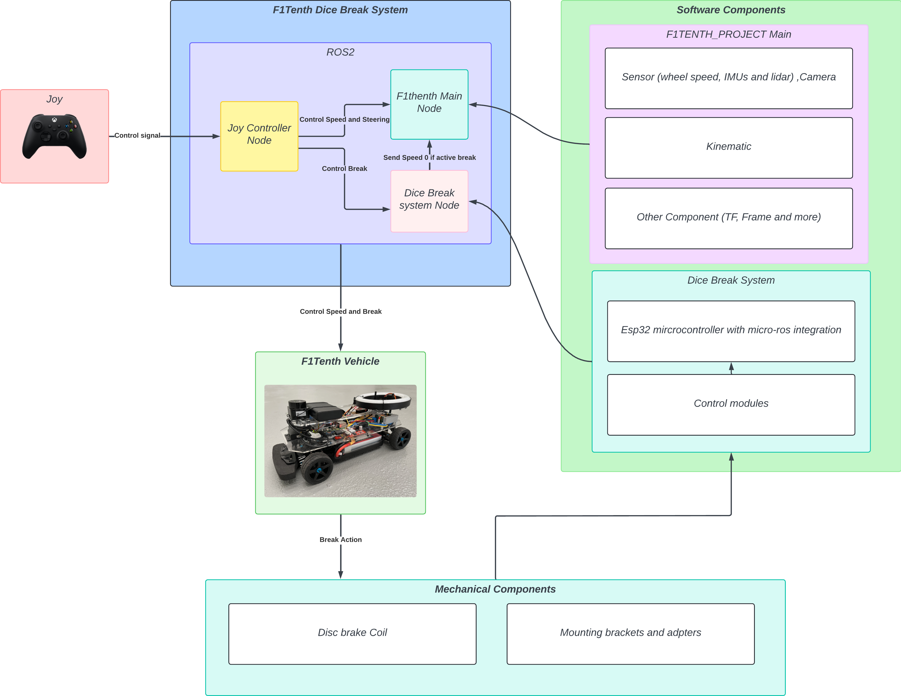
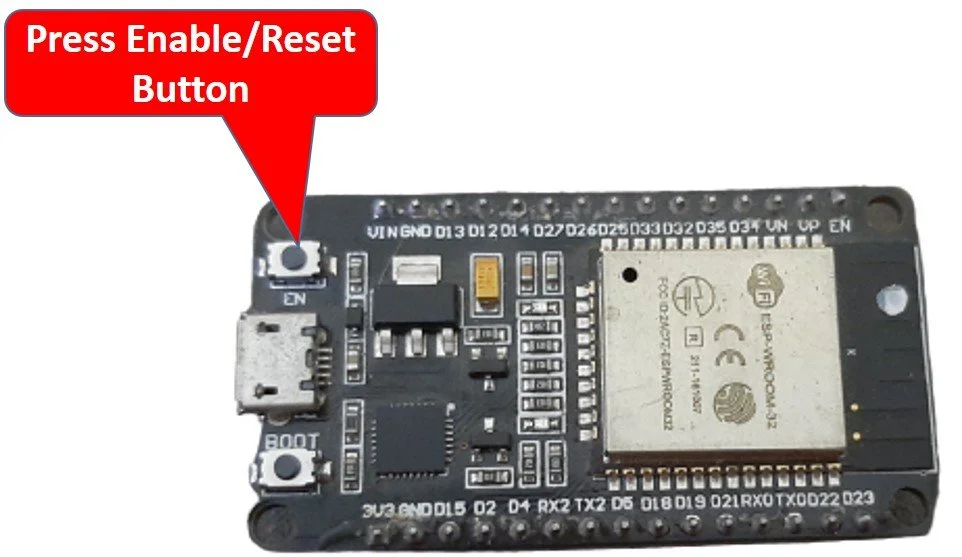
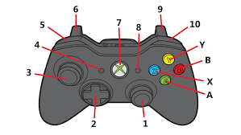
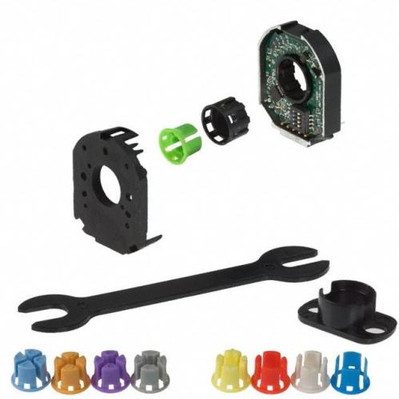
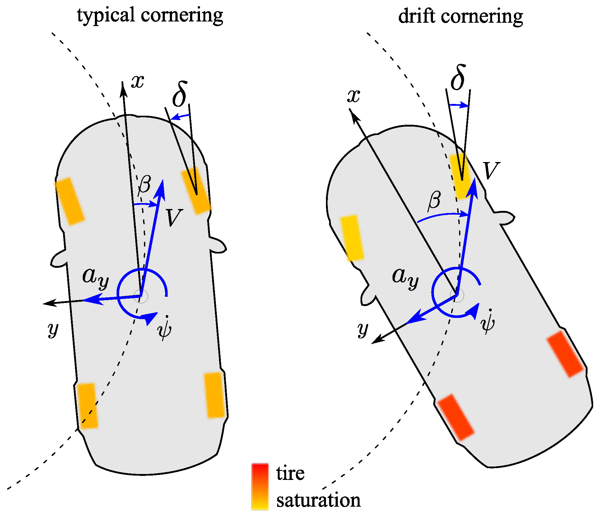
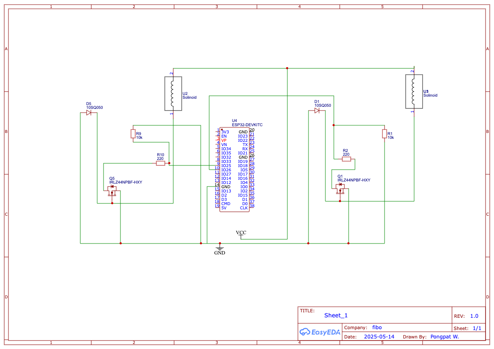
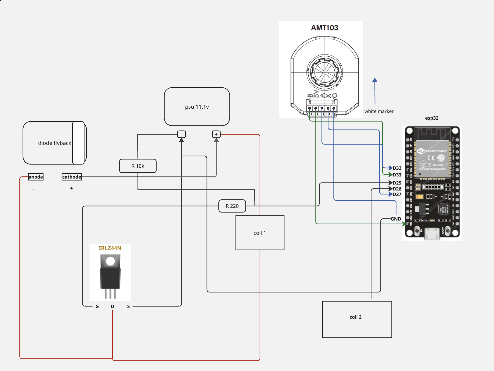
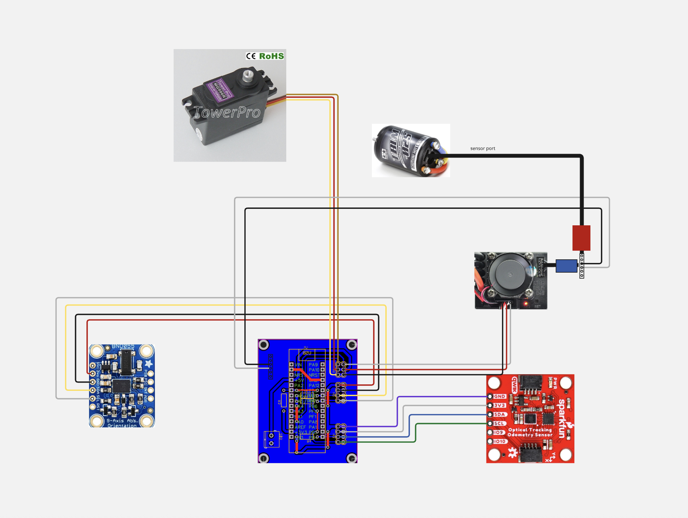
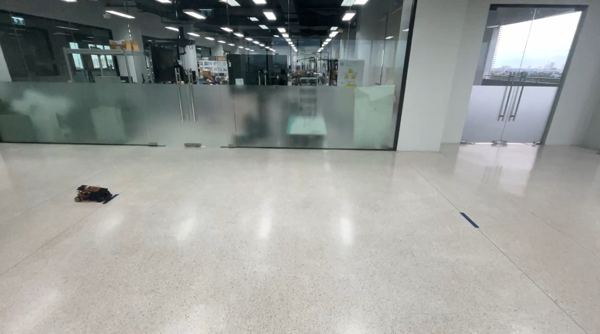
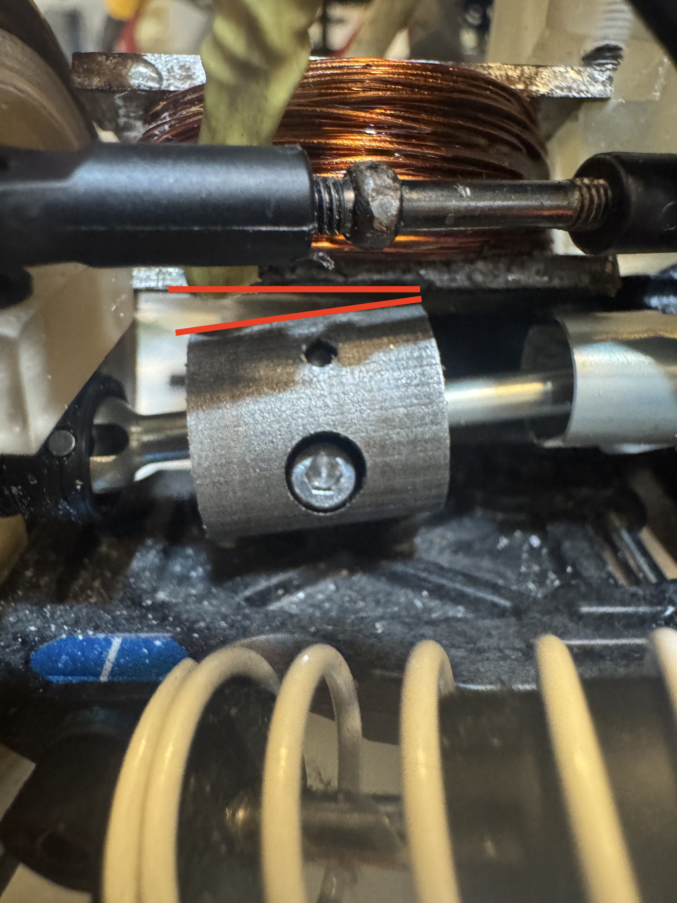

# 🏎️ F1TENTH Braking System

**Disc Brake System for Controlled Drifting in F1TENTH**

This package is part of the broader [F1TENTH Project](https://github.com/kkwxnn/F1TENTH_PROJECT) and provides a disc brake control system to enable precise braking and controlled drifting in F1TENTH vehicles.

---

## 📖 Table of Contents

* [🚗 System Overview](#-system-overview)
* [🔧 Break Node System Overview](#-break-node-system-overview)
* [💻 Installation](#-installation)
* [🎮 Usage](#-usage)
* [📏 Additional Sensors](#-additional-sensors)
* [📐 Design Part](#design-part)
* [🧪 Experimental Coil Testing](#-experimental-coil-testing)
* [🧑‍🤝‍🧑 Our Team](#-our-team)
* [📚 References](#-references)

---

## 🚗 System Overview

<p align="center">
  
</p>

The F1TENTH Braking System integrates both software and hardware components to enable disc brake actuation and controlled drifting on your F1TENTH vehicle. The system uses ROS 2 for modular communication between nodes, an ESP32 microcontroller for real-time brake control, and a dedicated coil-based disc brake mechanism for reliable stopping power.

### Key Features

* **Joystick-based control** for speed, steering, and braking
* **ROS 2 nodes** for modular command processing
* **ESP32 microcontroller** with micro-ROS for low-latency actuation
* **Custom mechanical assemblies** for brake actuation

---

## 🔧 Break Node System Overview

<p align="center">
  
</p>

The **Break Node System** manages the actuation logic for the disc brake using ROS 2 topics and the ESP32 microcontroller:

| Component              | Description                                                           |
| ---------------------- | --------------------------------------------------------------------- |
| Joy Controller Node    | Publishes `/break_mode` (enable brake) and `/break_pwm` (brake level) |
| Dice Break System Node | Checks enable flag, passes duty to ESP32 or zeroes if disabled        |
| ESP32 microcontroller  | Drives brake coil using micro-ROS commands                            |

This structure ensures **safety**, **flexibility**, and **real-time control** for autonomous driving.

---

## 💻 Installation

> [!NOTE]
> Ensure the [F1TENTH Project](https://github.com/kkwxnn/F1TENTH_PROJECT) environment is set up before proceeding. This setup should be installed on a **Raspberry Pi**, which operates the F1TENTH Project.

### 1. Clone F1TENTH Project

> [!IMPORTANT]
> Clone the F1TENTH repository directly on your **Raspberry Pi** before continuing.

```bash
git clone https://github.com/kkwxnn/F1TENTH_PROJECT.git
```

### 2. Set Up Environment

Follow the [F1TENTH README](https://github.com/kkwxnn/F1TENTH_PROJECT/blob/humble/README.md) to configure your environment. Then **replace the [`docker-compose.yml`](./docker-compose.yml)** with the one from this repository to ensure brake system compatibility.

- What new in this `docker-compose.yml`:
  - Added `micro-ros-esp32` service for ESP32 communication.

  ```dockerfile
    micro_ros_agent_esp32:
    image: microros/micro-ros-agent:humble
    container_name: micro-ros-agent-esp32
    network_mode: host
    command: serial --dev /dev/ttyACM1 --baudrate 115200
    devices:
      - "/dev/ttyACM1:/dev/ttyACM1"
    restart: unless-stopped
    ```


  - Configured `desktop_ros2` to incude joystock device.
  ```dockerfile
      devices:
        - "/dev/input/js0:/dev/input/js0" # Joystick device
  ```

### 3. Navigate to `src` Directory

```bash
cd ~/F1TENTH_PROJECT/f1tenth_ws/src
```

### 4. Clone Brake Package

```bash
git clone https://github.com/peeradonmoke2002/f1tenth_breaking_system.git
```

### 5. Restart Docker Services

- Ensure you are in the `F1TENTH_PROJECT` directory:
```bash
cd ~/F1TENTH_PROJECT/
```
- Restart the Docker services to apply changes:

```bash
docker compose down
```
- Then start the services again:

```bash
docker compose up -d
```
>[!NOTE]
> If not working try to restart your Raspberry Pi.


### 5. Access ROS 2 Desktop via VNC

1. **Find your Raspberry Pi IP (wlan0 interface):**

```bash
ifconfig
```

2. **Open VNC in a browser:**

Navigate to:

```
http://<Your-IP-Address>:6080/
```

Replace `<Your-IP-Address>` with the one found in the previous step.

### 6. Build the Workspace

```bash
cd ~/f1tenth_ws/
rosdep update
rosdep install --from-paths src
colcon build --symlink-install
```

### 7. Source the Workspace

```bash
source ~/f1tenth_ws/install/setup.bash
```

---

## 🎮 Usage

> [!IMPORTANT]
> This section assumes you are running on the **VNC ROS 2 Desktop** on your Raspberry Pi. If not, please return to the [Installation](#-installation) section.

### 1. Start Robot Command Node

```bash
ros2 run robot_bridge RobotCommand.py
```

### 2. Launch Braking System

```bash
ros2 launch break_controller joystick.launch.py
```

> [!WARNING]
> Make sure the **ESP32** and **joystick** are connected. Verify that the `micro-ros-esp32` Docker container is actively running.

### 3. Verify Node and Topic Status

```bash
ros2 node list
ros2 topic list
```

Expected Nodes:

```
/break_controller
/joy_control
/joy_node
/robot_commnad_node
```

Expected Topics:

```
/cmd_vel
/cmd_steer
/mcu_cmd
/joy
/joy/set_feedback
/break_mode
/break_pwm
```

> [!WARNING]
> If `/break_mode` or `/break_pwm` are missing, press the reset button on your ESP32 board.
> <p align="center">
>   
></p>

### 4. Joystick Control
To control the braking system, use a joystick. The following table outlines the button mappings for the Xbox controller:

<p align="center">
  
</p>

| Button | Action                                      |
| ------ | ------------------------------------------- |
| B      | Toggle driving direction (forward/backward) |
| 3      | Steer left/right (horizontal axis)          |
| 5      | Enable brake (hold)                         |
| 6      | Apply brake force (hold, variable strength) |
| 10     | Enable speed and steering control                         |
| 9      | Apply throttle (0.0 m/s up to current max speed setting)  |
| Y      | Increase maximum speed (up to 3.0 m/s)                    |
| A      | Decrease minimum speed (down to 0.2 m/s)                  |

> [!CAUTION]
> Do not hold the brake for long periods. Continuous actuation may cause overheating and damage to the coil or MOSFET. Use short bursts for optimal drifting.

---

## 📏 Additional Sensors

To enhance steering control, the system integrates an **AMT103 rotary encoder**, which provides high-resolution angular feedback to improve vehicle direction control.

<p align="center">
  
</p>

### Encoder Usage

#### 1. Check Topic

Ensure the encoder topic is published as shown below:

```
[AMT103 Encoder] → [ESP32 + micro-ROS] → [/enc_steer_raw] → [encoder2angle.py] → [/enc_steer]
```

To verify:

```bash
ros2 topic list  # Ensure /enc_steer_raw is visible
```

#### 2. Run Processing Script

```bash
ros2 run break_controller encoder2angle.py  # Publishes /enc_steer
```

---
## 📐 Design Part
### Drift Concept

Drifting is a driving technique that involves intentionally inducing **oversteer**, causing a loss of traction in the rear wheels while maintaining control throughout a corner. In this project, we focus on enabling controlled drift by tuning the balance between **traction**, **power**, and **braking force**, especially with a **rear-wheel drive (RWD)** configuration.

<p align="center">
    
</p>

- In **typical cornering**, the front tires steer in the direction of the curve while the rear tires maintain grip.
- In **drift cornering**, the car rotates into the turn with the **rear tires saturated**, sliding outward, while the front wheels counter-steer to guide the direction.
- The vehicle exhibits a **high sideslip angle (β)** and controlled **yaw rate (ψ)**, while lateral acceleration (**aᵧ**) still points toward the center of the curve.

### Things to Consider

- Rear tire traction is intentionally reduced to initiate drift.
- Front tires must maintain enough grip for counter-steering control.
- Weight transfer helps unsettle the rear end.
- Tire compound and surface friction significantly affect driftability.
- Balance between motor torque and braking response is critical for stable drift control.

### Transmisstion system
Originally based on an all-wheel-drive (AWD) layout, the F1TEETH platform has been modified to **rear-wheel drive (RWD)** to improve the ability to break traction at the rear wheels. This configuration allows better control over drifting behavior and enables intentional oversteer, which is essential for sustained drifts.

To achieve this, the **driveshaft connecting the motor to the front wheels was removed**, effectively disabling the front-wheel drive and converting the system into a purely rear-wheel-driven platform.

## Braking System
I chose to use a magnetic braking system because it requires the **least amount of space for installation**, especially compared to traditional servo-based brakes, which are often bulky. The magnetic setup is also **lighter in weight**, making it more suitable for small-scale RC vehicles. Additionally, this design allows for the possibility of implementing **ABS-like behavior**, helping the car come to a stop smoothly and precisely with minimal wheel lock-up.


### Schematic & Wiring Diagram


<p align="center">
    
</p>

<p align="center">
    
</p>


<p align="center">
    
</p>


<!-- * **Braking Schematic:** [Braking Schematic](/.images/Schematic_break_2025-06-20.png) -->


### Drum Brake Specifications
| Property         | Value   |
|------------------|---------|
| Outer Diameter   | 14.5 mm |
| Drump Thickness   | 3 mm    |
| Axial Length     | 15.6 mm |

### Coil Specifications

| Property         | Value              |
| ---------------- | ------------------ |
| Core Type        | Steel              |
| Outer Diameter   | 12 mm              |
| Inner Diameter   | 8 mm               |
| Wire Used        | 0.5 mm magnet wire |
| Power            | 12V DC             |
| Resistance       | \~1.5 Ω            |
| Current          | \~8 A              |
| Application Load | \~2 kg             |

### Magnetic Force Estimation

| Symbol | Value          | Description                   |
| ------ | -------------- | ----------------------------- |
| N      | 270 turns      | Number of coil windings       |
| I      | 8 A            | Coil current                  |
| A      | 1.13 × 10⁻⁴ m² | Core area (radius = 6 mm)     |
| g      | 0.0003 m       | Air gap (0.3 mm)              |
| μᵣ     | 1000           | Relative permeability (steel) |
| μ₀     | 4π × 10⁻⁷ H/m  | Vacuum permeability constant  |

$$
F = \frac{N^2 \cdot \mu \cdot A \cdot I^2}{2 \cdot g^2}
$$

**Estimated force:** 60 N at full load > RC car mass 3 KG

## 🧪 Experimental Coil Testing

### Front vs Rear Wheel Understeering

The following videos demonstrate the difference in understeering behavior between front-wheel and rear-wheel drive configurations:

- [Front wheel understeering F1TEETH](https://youtu.be/fvo7P59drMA) — In front-wheel drive, **understeer typically requires braking** to shift the weight forward and reduce rear traction. Without braking, the front wheels tend to maintain grip, limiting the ability to rotate the vehicle.
- [Rear wheel understeering F1TEETH](https://youtu.be/cZtpaluhPYI) — In rear-wheel drive, the car can **naturally induce understeer without braking**, due to rear torque overpowering traction. This makes it easier to break rear grip and start a drift even without applying the brake.

### Inertial Braking Test Results

Inertial Braking Test Results

<p align="center">
  

To test the effectiveness of each braking method, the car was released from a fixed starting point and allowed to accelerate under consistent conditions. The braking system was activated when the car reached a marked finish line. Two braking methods were compared:

1. **ESC Brake** — electronic braking via the speed controller
2. **Coil Brake** — electromagnetic braking using the custom coil 

| Round | Distance (cm) | Brake Type |
| ----- | ------------- | ---------- |
| 1     | 292           | ESC Brake  |
| 1     | 146           | Coil Brake |
| 2     | 284           | ESC Brake  |
| 2     | 146.5         | Coil Brake |
| 3     | 302           | ESC Brake  |
| 3     | 168           | Coil Brake |


**Observation:**  
The coil brake consistently results in shorter stopping distances, confirming its ability to reduce rotational inertia more effectively than standard ESC braking. This allows the car to enter drift states more predictably and stop in tighter spaces.

### Known Issues (MK I)

* **1.1** Mount misalignment between the coil’s actuator surface and the brake dump

<p align="center">
    
</p>

### Roadmap

- [ ] Connect circuit board with opto-isolate
- [ ] Front Break
- [ ] replace DIY Board with pcb 
- [ ] Reposition the shock absorber mounting
- [ ] Minimize backlash on steering ackermann 
---

## 🧑‍🤝‍🧑 Our Team

| Student ID  | Name                   |
| ----------- | ---------------------- |
| 67340700402 | พงษ์พัฒน์ วงศ์กำแหงหาญ |
| 67340700403 | พีรดนย์ เรืองแก้ว      |


---


## 📚 References

[A Torque Vectoring Control for Enhancing Vehicle Performance in Drifting](https://www.mdpi.com/2079-9292/7/12/394)

[How To Winding the Magnet Wire](https://www.instructables.com/POWERFUL-ELECTROMAGNET-5KG-LIFTING/)